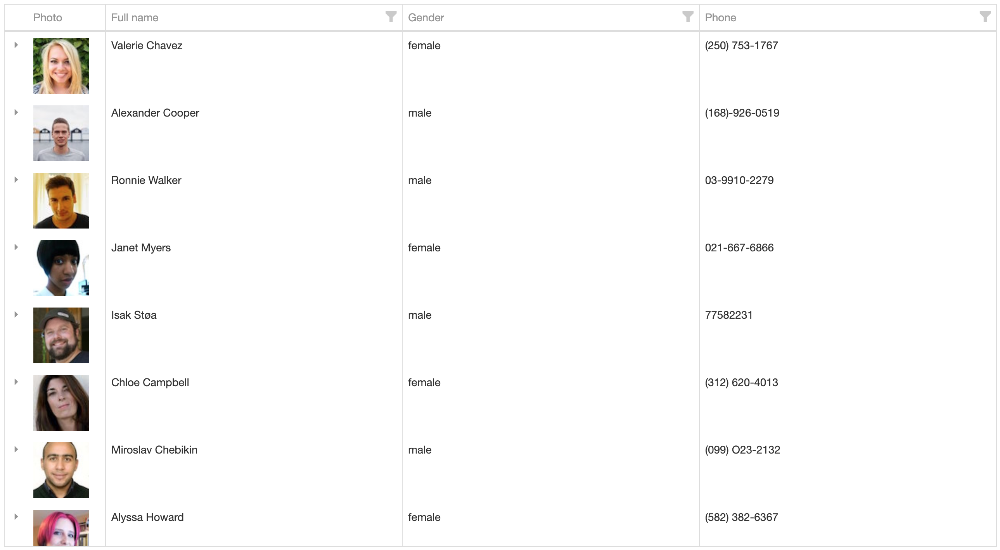

# UserData

See demo by [this link](https://zoromari.github.io/user-data/about) 

#### Functionality

This demo application provides information about randomly generated users in a handy table.

#### Technologies:

This project was generated with **Angular CLI** version 14.0.7.

For this project, I used the **Bootstrap and Devexpress**.

API for receiving user: https://randomuser.me/

#### Running App:

Run `npm start` for a dev server. Navigate to `http://localhost:4200/`. The application will automatically reload if you change any of the source files.
